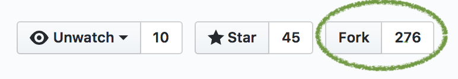

# Primeros pasos

## Instala Node.js

Dirígete a la [web oficial de NodeJs](https://nodejs.org/en/) y descarga la última versión disponible en LTS \(Long Time Support\).

## Instala un editor de texto

Necesitas una aplicación en la que escribir tu código. Hay muchas opciones populares y gratuitas. Si no tienes alguna elegida, aquí hay algunas recomendaciones:

* [Visual Studio Code](https://code.visualstudio.com/)
* [Sublime Text](https://www.sublimetext.com/)
* [Atom](https://atom.io/)

## Descarga el código de Github

El código necesario para este tutorial está en un **repositorio de Github.**

Para conseguir el código, tienes dos opciones:

Copy the code to your own GitHub account, then download it  
- or -

* Copia el código a tu propia cuenta de Github, para después descargarlo - o -
* [Simplemente descarga el código \(avanza hasta el final de la página\)](primeros-pasos.md#simplemente-descargalo)

### Copia el código a tu propia cuenta de Github

Antes de nada, necesitarás crearte una cuenta de GitHub. Después accede a [https://github.com/node-girls/express-workshop](https://github.com/node-girls/express-workshop).

En la esquina superior derecha de la página, deberías ver un botón que pone "Fork". Haz click para copiar el código en tu cuenta de GitHub.



Ahora que tienes tu propio **fork** del repositorio de Node Girls, puedes descargarlo en tu ordenador.

Ve a tu consola de comandos en tu ordenador y abre una nueva ventana. Si usas un Mac o Linux será Terminal, PowerShell si usas Windows. Desde ahí, navega hacia el lugar en el que quieres guardar tu código, quizás en tu escritorio o en tu carpeta Documentos.


Si no te sientes cómoda usando la línea de comandos, ¡pregunta a una mentora y ella te enseñará como continuar!


Ejecuta el siguiente comando



```bash
$ git clone https://github.com/YOUR-GITHUB-USERNAME/express-workshop
```



Reemplaza YOUR-GITHUB-USERNAME con tu usuario de GitHub  🙃

### Simplemente descárgalo

Si no quieres tener una cuenta en GitHub o no deseas hacer un **fork**, puedes descargarlo directamente desde el repositorio de Node Girls.

Ve a  [https://github.com/node-girls/express-workshop](https://github.com/node-girls/express-workshop), y busca el botón verde que dice "Clone or Download". Descarga los archivos como un `.zip` , después búscalo en tu ordenador y extrae el contenido donde desees guardarlo.

