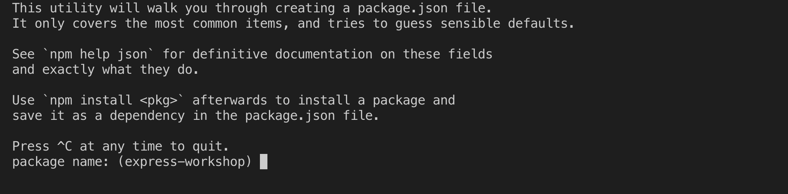
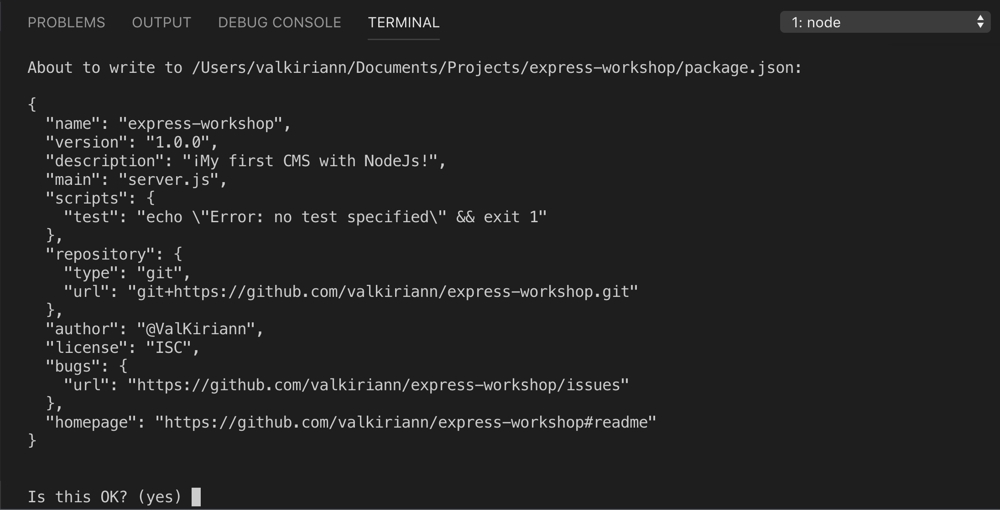

# Capítulo 1: Configurando tu proyecto

A la hora de crear un proyecto en NodeJs, normalmente instalarás cosas por el camino. Si deseas compartir el proyecto con alguien, necesitas hacer una lista de las cosas instaladas, para que los demás sepan que tienen que instalar para poder ejecutar tu proyecto.

En NodeJs, esta "lista" es un archivo llamado `package.json`. "Las cosas instaladas" se denominan dependencias. La creación de este archivo es el primer paso para configurar tu proyecto en NodeJs. En él además se incluyen todos los detalles 

## Crea un archivo `package.json`

Empezaremos por crear un archivo `package.json`. Podemos añadirle cosas según avance el proyecto. El archivo `package.json` es fácil de crear a través de la línea de comandos. Ejecuta este comando en una ventana de terminal que esté situada en la raíz de tu proyecto para empezar el proceso:



```bash
$ npm init
```




El signo dolar \($\) no se tiene que escribir al ejecutar el comando. Está aquí para representar que es un comando de terminal.


Este comando iniciará un proceso paso-a-paso para la creación del`package.json`. Deberías ver algo parecido a esto: 



Durante este proceso, la ventana de terminal te pedirá datos para configurar el proyecto:

**name**

npm te sugerirá un nombre por defecto para tu proyecto entre paréntesis, normalmente el nombre de tu directorio raíz del proyecto. Si deseas elegir otro nombre, escríbelo y pulsa `Enter`. Si estás conforme con el nombre por defecto, pulsa `Enter`.

**version**

¡Este es tu primer proyecto! Normalmente un proyecto empieza en la versión 1.0.0 así que puedes pulsar `Enter`.

**description**

La descripción de el proyecto. Escribe lo que desees aquí y pulsa `Enter`.

**entry point**

entry point es donde indicas dónde se encuentra el punto de entrada del proyecto. Vamos a cambiar el valor por defecto de `index.js` a `server.js` y pulsa `Enter`.

**test command**

En este taller no vamos a hablar sobre **testing**, saltemos este paso pulsando `Enter`.

**git repository**

Aquí es donde puedes proporcionar una url de GitHub. Si has hecho un **fork** del proyecto y luego lo has clonado aparecerá por defecto tu repositorio. Si has clonado desde Node Girls aparecerá el repositorio de la comunidad pero no podrás mandar tus cambios. Si simplemente lo has descargado no habrá ninguna url. Pulsa `Enter`.

**keywords**

\(Opcional\) Puedes añadir palabras clave para definir tu proyecto. Pulsa `Enter`.

**author**

Este es tu proyecto, ¡pon tu nombre! También puedes usar tu usuario de GitHub o un pseudónimo. Pulsa `Enter`.

**license**

Aquí es donde se indica el tipo de licencia. Por el momento pulsa `Enter`.

### Confirmación

Al terminar de rellenar todos los datos verás una previsualización del archivo `package.json`. Si estás contenta con los datos, pulsa `Enter` para finalizar la creación.



¡Genial! Deberías ver un nuevo archivo llamado `package.json` en la raíz de tu carpeta.

