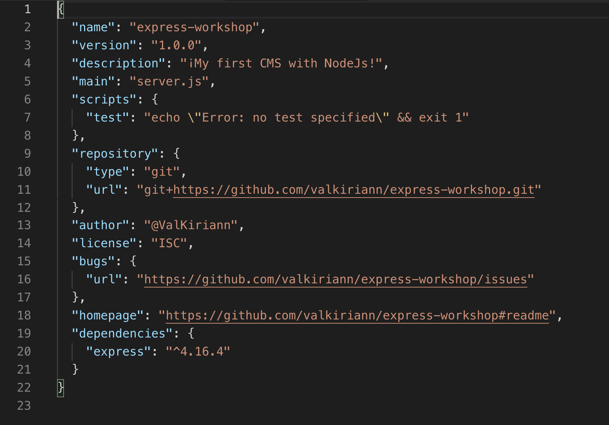

# Capítulo 2: Instalando Express

Antes de escribir código, necesitas instalar la librería de Express. Vamos a usar el gestor de paquetes de Node \[ [**Node Package Manager \(npm\)**](https://www.npmjs.com/) ****\] ****para descargar y usar el comando **`npm install`**.

NPM es el lugar que visitar para descargar paquetes y liberías de Node escritas por otras personas. Hay miles de módulos de terceros y open source \(también conocidos como paquetes \("packages"\) que puedes descargar y usar en tus propios proyectos.

Al instalar Express, tenemos que actualizar nuestro archivo`package.json` y añadir Express como dependencia del proyecto. Esto lo hacemos para que otra gente que quiera consumir o trabajar en el proyecto sepa que tiene que instalar Express antes de ejecutar el proyecto. Para hacerlo debes añadir la **flag** \(etiqueta\) `--save` al final del comando de instalación.

**Ejecuta el siguiente comando en tu terminal:**



```bash
$ npm install express --save
```



Express procederá a instalarse. Comprueba tu archivo `package.json` para asegurarte que se ha añadido como dependencia, debería aparecer algo así:



