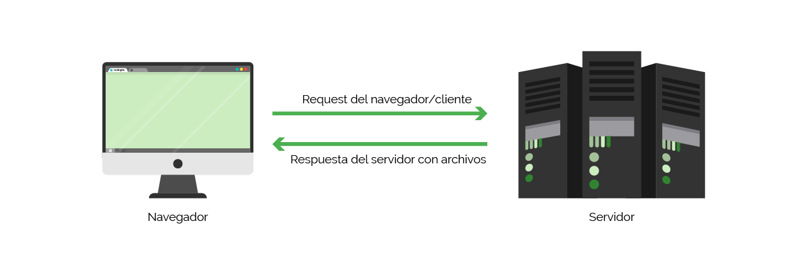
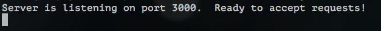

# Capítulo 3: creando el servidor

Siempre que programes para back-end necesitarás montar un servidor. Un servidor se puede programar puramente en NodeJs, pero Express facilita mucho las cosas.

### ¿Qué es un servidor?

> Los servidores son programas que reciben requests \(peticiones\) de otros programas, los clientes, y manda una respuesta de vuelta con datos, información o recursos de hardware o software.

#### ...y... ¿qué es exactamente un servidor?

Un servidor es un programa informático. Su trabajo es mandar y recibir datos.

Vamos a coger una página web como ejemplo. Una página web es una colección de archivos HTML y CSS, imágenes, puede que algunos archivos javascript. Cuando escribes una dirección url en la barra de tu navegador, el propio navegador \(el cliente\) manda una **request** \(petición\) al servidor que vive en esa dirección. El navegador le pide al servidor que le entregue los archivos que necesita para mostrar la página web de forma correcta.



### 1. Crea el archivo `server.js`

Crea un nuevo archivo `server.js`. En él es donde el código de nuestro servidor va a vivir.

### 2. `require` the Express library %%%

Hemos instalado Express en el capítulo 2, pero necesitamos incluir la dependencia en este archivo para poder usar sus métodos. En NodeJs, cuando quieres acceder a las funcionalidades de una librería o **módulo** de otro archivo, tienes que requerirlo.

Para importar Express, escribe la siguiente línea en tu archivo `server.js`:



```javascript
var express = require('express');
```



### 3. Inicia el servidor

Para iniciar el servidor, sólo tenemos que llamar a la función `express()` . Esto creará una aplicación de Express con la que trabajar.

Añade tu segunda línea al archivo `server.js` :



```javascript
var express = require('express');
var app = express();
```



### 4. Empieza a "escuchar" potenciales requests

Sólo nos queda un paso más, necesitamos elegir un puerto por el que nuestro servidor escuchará. Piensa en el puerto como en el número de una puerta, cualquier peticición que se haga al servidor vendrá de esa puerta. Elegir un puerto nos permitirá encontrar donde se ejecuta nuestro servidor.

Usamos el método **`app.listen`** para escuchar por el puerto. Este método necesita dos argumentos: un **puerto** y una función **callback** \(de respuesta\) que indica qué hacer una vez que el servidor esté funcionando. ¿Necesitas algo más de información? Puedes leer más sobre el método `app.listen` en la documentación de [Express](http://expressjs.com/en/4x/api.html#app.listen) \(en inglés\).

Vamos a ejecutar nuestro servidor en el puerto `3000`, y haremos un `console.log` en nuestro callback. Actualiza tu archivo `server.js`, llamando al método `app.listen`:



```javascript
var express = require('express');
var app = express();

app.listen(3000, function () {
  console.log('Server is listening on port 3000. Ready to accept requests!');
});
```



### 5. ¡Enciende el servidor!

Has montado el servidor, pero no está ejecutándose todavia. Tenemos que ejecutar un comando en la terminal para hacerlo. Vamos a usar la palabra clave `node` para lanzar nuestro archivo servidor.

Escribe el siguiente comando en una ventana de terminal desde la raíz del proyecto:



```bash
$ node server.js
```



Si ves esto, ¡enhorabuena! ¡Acabas de construir tu propio servidor!



